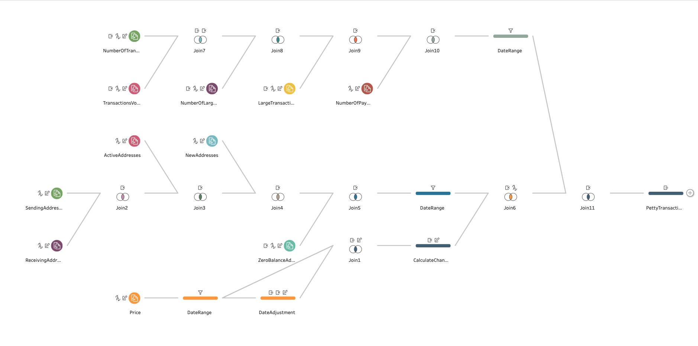
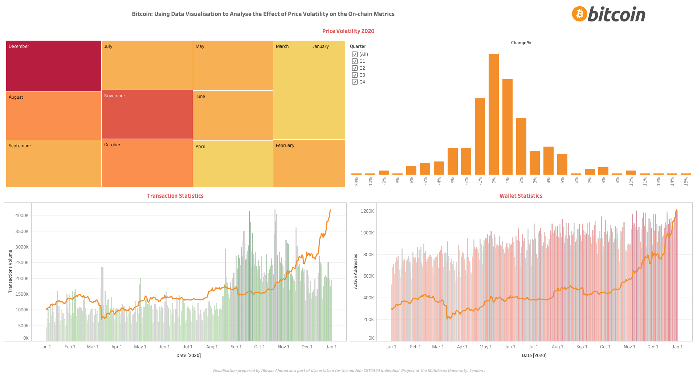
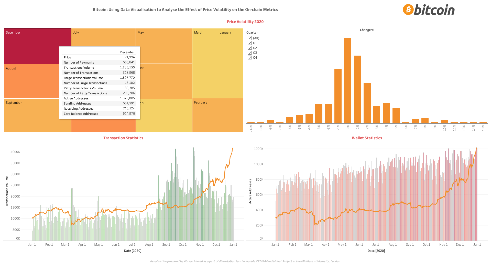
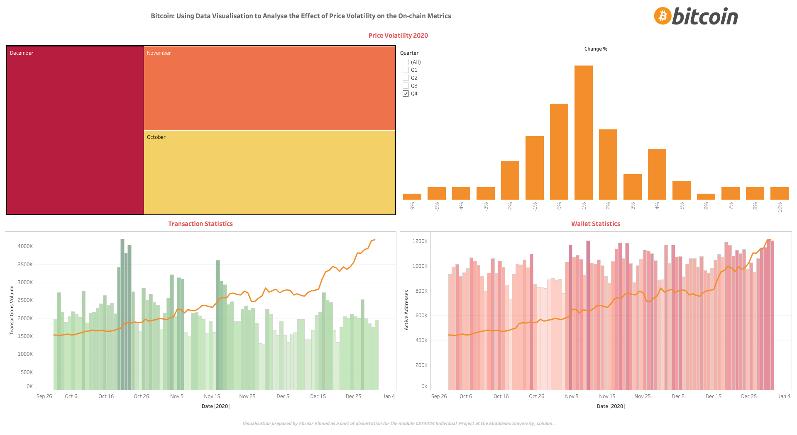
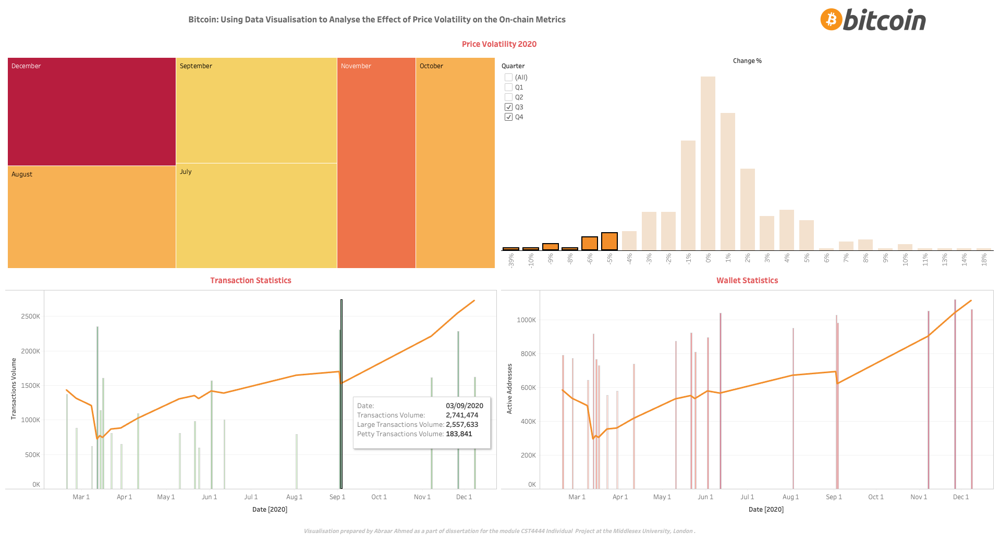

# Bitcoin: Using Data Visualisation to Analyse the Effect of Price Volatility on the On-chain Metrics
An interactive data visualisation dashboard built using Tableau Desktop to research and analyse the relationship between the price volatility and adoptability of bitcoin.

_Developed as a part of the dissertation project 'Bitcoin: Using Data Visualisation to Analyse the Effect of Price Volatility on the On-chain Metrics' at Middlesex University, London._

## Problem Statement
Bitcoin was supposed to be used as an instrument to conduct transaction between two parties. But after being linked heavily with fiat money through various currencies, the price volatility has made it risky to transact using Bitcoin. Regulating the price of Bitcoin or the related volatility is not possible because of its decentralised nature. Through the trading volume and price fluctuations, it can be explained that Bitcoin is used as a trading asset; but is it also being used as a currency to perform transactions is what needs to be analysed?

## Data Preparation
On-chain data from multiple sources was gathered, cleaned and tailored as per the requirements.

## Dashboard

